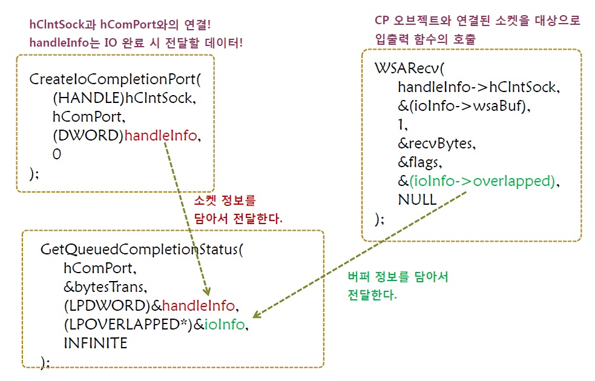

# CH 23. IOCP(Input Output Completion Port)

## 23-1. Overlapped IO를 기반으로 IOCP 이해하기

### 넌-블로킹 모드의 소켓 구성하기

넌-블로킹 모드의 소켓 구성

```c
SOCKET hLisnSock;

// mode에 저장된 값 1은 넌-블로킹 소켓의 옵션 지정에 사용된다.
int mode = 1;
....
hLisnSock = WSASocket(PF_INET, SOCK_STREAM, 0, NULL, 0, WSA_FLAG_OVERLAPPED);

// 입출력 모드(FIONBIO)를 변수 mode에 저장된 값으로 바꿔라.
ioctlsocket(hLisnSock, FIONBIO, &mode); // for non-blocking socket
... .
```

넌-블로킹 모드 소켓의 입출력 이외의 추가적인 특징

-   클라이언트의 연결요청이 존재하지 않는 상태에서 accept 함수가 호출되면 INVALID_SOCKET이 곧바로 반환된다. 그리고 이어서 WSAGetLastError 함수를 호출하면 WSAEWOULDBLOCK가 반환된다.
-   accept 함수호출을 통해서 새로 생성되는 소켓 역시 넌-블로킹 속성을 지닌다.

### Overlapped IO만 가지고 에코 서버 구현해보기.

구조체 변수에 담겨 있는 정보만 참조해도 데이터의 송수신이 가능하도록 구조체를 정의한다.

```c
typedef struct
{
  SOCKET hClntSock;
  char buf[BUF_SIZE];
  WSABUF wsaBuf;
} PRE_IO_DATA, *LPPER_IO_DATA;
```

### Overlapped IO 기반인 에코 서버 예제와 예제의 동작 원리

-   클라이언트가 연결되면 WSARecv 함수를 호출하면서 넌-블로킹 모드로 데이터가 수신되게 하고, 수신이 완료되면 ReadRoutine 함수가 호출되게 한다.
-   ReadRoutine 함수가 호출되면 WSASend 함수를 호출하면서 넌-블로킹 모드로 데이터가 수신되게 하고, 수신이 완료되면 WriteRoutine 함수가 호출되게 한다.
-   이렇게 해서 호출된 WriteRoutine 함수는 다시 WSARecv 함수를 호출하면서 넌-브로킹 모드로 데이터의 수신을 기다린다.

`입출력 완료 시 자동으로 호출되는 Completion Routine 내부로 클라이언트 정보(소켓과 버퍼)를 전달하기 위해서 WSAOVERLAPPED 구조체의 멤버 hEvent를 사용하였다.`

> Overlapped IO 기반인 에코 서버<br>
> [CmplRouEchoServ_win.c](https://github.com/wheejinv/C-TCPIP-Practice/blob/master/Window/23_IOCP_CmpRouEchoServ/CmplRouEchoServ_win.c)<br>
>
> Stable Echo Client<br>
> [StableEchoClnt_win.c](https://github.com/wheejinv/C-TCPIP-Practice/blob/master/Window/23_IOCP_StableEchoClient/StableEchoClnt_win.c)

### Overlapped IO 모델에서 IOCP 모델로

Overlapped IO 모델의 에코 서버가 지니는 단점

-   넌-블로킹 모드의 accept 함수와 alertable wait 상태로의 진입을 위한 SleepEx 함수가 번갈아 가며 반복호출되는 것은 성능에 영향을 미칠 수 있다.

문제의 해결

-   accept 함수의 호출은 main 쓰레드가(main 함수) 처리하도록 하고, 별도의 쓰레드를 추가로 하나 생성해서 클라이언트와의 입출력을 담당하게 한다.

### IOCP에서 제안하는 서버의 구현 모델

IOCP에서는 IO를 전담하는 쓰레드를 별도로 생성한다. 그리고 이 쓰레드가 모든 클라이언트를 대상으로 IO를 진행하게 한다.<br>
IOCP를 관찰할 때에 다음의 두 가지 관점에서 관찰이 필요하다.

-   입력과 출력은 넌-블로킹 모드로 동작하는가?
-   넌-블로킹 모드로 진행된 입력과 출력의 완료는 어떻게 확인하는가?

## 23-2. IOCP의 단계적 구현

### Completion Port의 생성

IOCP에서는 완료된 IO의 정보가 `Completion Port 오브젝트(CP 오브젝트)`라는 커널 오브젝트에 등록된다. 이를 위해서는 다음의 요구를 별도로 진행해야 한다.

-   `이 소켓을 기반으로 진행되는 IO의 완료 상황은 저 CP 오브젝트에 등록해주세요.`<br>

CP 오브젝트에 IO의 완료가 등록될 수 있도록 다음 두 가지가 선행되어야 한다.

-   Completion Port 오브젝트의 생성
-   Completion Port 오브젝트와 IO의 완료를 등록할 소켓과의 연결

### CreateIoCompletionPort 함수의 두 가지 기능

#### CP 오브젝트의 생성 관점에서의 함수

```c
#include <windows.h>

// 성공 시 CP 오브젝트의 핸들, 실패 시 NULL 반환
HANDLE CreateIoCompletionPort(HANDLE    FileHandle,
                              HANDLE    ExistingCompletionPort,
                              ULONG_PRT CompletionKey,
                              DWORD     NumberOfConcurrentThreads);
```

-   `FileHandle` : CP 오브젝트 생성시에는 INVALID_HANDLE_VALUE를 전달.
-   `ExistingCompletionPort` : CP 오브젝트 생성시에는 NULL 전달.
-   `CompletionKey` : CP 오브젝트 생성시에는 0 전달.
-   `NumberOfConcurrentThreads` : CP 오브젝트에 할당되어 완료된 IO를 처리할 쓰레드의 수를 전달. 예를 들어 2가 전달되면 CP 오브젝트에 할당되어 동시 실행 가능한 쓰레드의 수는 최대 2개로 제한된다. 그리고 이 인자에 0이 전달되면 시스템의 CPU 개수가 동시 실행 가능한 쓰레드의 최대수로 저장된다.

ex) CP 오브젝트에 할당되어 IO의 처리를 담당할 쓰레드의 수를 최대 2개로 제한.

```c
HANDLE hCpObject;
....
hCpObject = CreateIoCompletionPort(INVALID_HANDLE_VALUE, NULL, 0, 2);
```

#### CP 오브젝트와 소켓의 연결의 관점에서의 함수

```c
#include <windows.h>

// 성공 시 CP 오브젝트의 핸들, 실패 시 NULL 반환
HANDLE CreateIoCompletionPort(HANDLE    FileHandle,
                              HANDLE    ExistingCompletionPort,
                              ULONG_PRT CompletionKey,
                              DWORD     NumberOfConcurrentThreads);
```

-   `FileHandle` : CP 오브젝트에 연결한 소켓의 핸들 전달.
-   `ExistingCompletionPort` : 소켓과ㅐ 연결할 CP 오브젝트의 핸들 전달.
-   `CompletionKey` : 완료된 IO 관련 정보의 전달을 위한 매개변수, 이는 잠시 후에 소개하는  GetQueuedCompletionStatus 함수와 함께 이해해야 함.
-   `NumberOfConcurrentThreads` : 어떠한 값을 전달하건, 이 함수의 두 번째 매개변수가 NULL이 아니면 그냥 무시된다.

ex) 다음의 CreateIoCompletionPort 함수가 호출된 이후부터는 hSock을 대상으로 진행된 IO 완료 시, 해당 정보가 hCpObject에 해당하는 CP 오브젝트에 등록된다.

```c
HANDLE hCpObject;
SOCKET hSock;
....
hCpObject = CreateIoCompletionPort((HANDLE)hSock, hCpObject, (DWORD)ioInfo, 0);
```

### Completion Port의 완료된 IO 확인과 쓰레드의 IO처리

CP에 등록되는 완료된 IO의 확인방법에 사용되는 함수. <br>
**아래의 함수호출을 통해서 CreateIoCompletionPort 함수호출 시 전달된 정보와 WSASend, WSARecv 함수호출 시 전달된 정보를 얻게 된다. 그리고 이 정보를 통해서 클라이언트에게 서비스를 제공하게 된다.**<br>
즉 함수의 반환결과를 통해서 다음 두 가지 정보를 얻어야 한다.

-   입출력이 발생한 소켓의 핸들 정보
-   입출력과 관련된 데이터 송수신 버퍼의 정보

```c
#include <windows.h>

// 성공 시 TRUE, 실패 시 FALSE 반환
BOOL GetQueuedCompletionStatus(HANDLE           CompletionPort,
                               LPDWORD          lpNumberOfBytes,
                               PULONG_PTR       lpCompletionKey,
                               LPWSAOVERLAPPED *lpOverlapped,
                               DWORD            dwMilliseconds);
```


-   `CompletionPort` : 완료된 IO 정보가 등록되어 있는 CP 오브젝트의 핸들 전달.
-   `lpNumberOfBytes` : 입출력 과정에서 송수신 된 데이터의 크기정보를 저장할 변수의 주소 값 전달.
-   `lpCompletionKey` : CreateIoCompletionPort 함수의 세 번째 인자로 전달된 값의 저장을 위한 변수의 주소 값 전달.
-   `lpOverlapped` : WSASend, WSARecv 함수호출 시 전달하는 OVERLAPPED 구조체 변수의 주소 값이 저장될, 변수의 주소 값 전달.
-   `dwMilliseconds` : 타임아웃 정보전달, 여기서 지정한 시간이 완료되면 FALSE를 반환하면서 함수를 빠져나가며, INFINITE를 전달하면 완료된 IO가 CP 오브젝트에 등록될 때까지 블로킹 상태에 있게 된다.

### GetQueuedCompletionStatus 함수호출과 데이터의 전달 관계



### CompletionPort에 할당되는 쓰레드의 의미

CP 오브젝트에 할당되는 쓰레드의 의미 이해하기

-   코드상에서 쓰레드의 CP 오브젝트 할당과정은 별도로 존재하지 않는다. CP 오브젝트에 할당된 쓰레드는 `CP 오브젝트를 대상으로  GetQueuedCompletionStatus 함수를 호출하는 쓰레드`를 뜻한다. 즉, CP 오브젝트에 할당가능한 쓰레드의 수를 2개로 제한한다는 것은  GetQueuedCompletionStatus 함수를 동시에 호출할 수 있는 쓰레드의 수를 2개로 제한한다는 뜻이다.
-   GetQueuedCompletionStatus 함수를 호출하는 쓰레드는 IO를 처리하는 쓰레드이다. IO 처리에 필요한 결과를 GetQueuedCompletionStatus 함수가 반환하기 때문이다. 그리고 이러한 역할을 담당하는 쓰레드는 직접 생성해야 한다.

### IOCP 기반의 에코 서버 구현

> [IOCPEchoServ_win.c](<>)

### IOCP가 성능이 좀더 나오는 이유

-   넌-블로킹 방식으로 IO가 진행되기 때문에, IO 작업으로 인한 시간의 지연이 발생하지 않는다.
-   IO가 완료된 핸들을 찾기 위해서 반목문을 구성할 필요가 없다. (select 모델과 비교한다면)
-   IO의 진행대상인 소켓의 핸들을 배열에 저장해 놓고, 관리할 필요가 없다. (비동기 Notification IO 모델)
